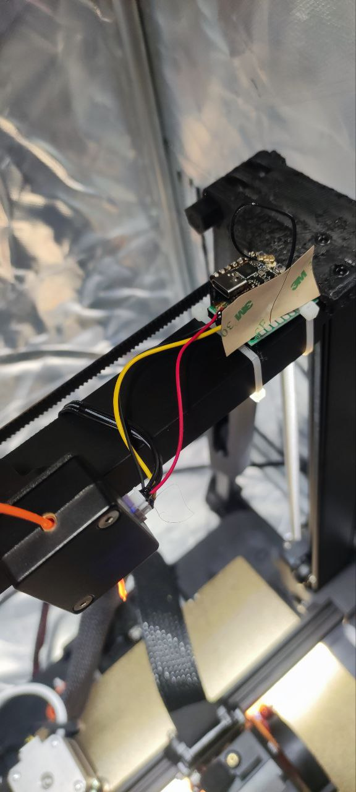

# Runout Sensor Octoprint Duplicator  

The project aimed at addressing a critical issue encountered by Ender 3 v3 users, where the runout sensor fails to trigger a command to OctoPrint when the filament runs out during a print job. The solution proposed involves utilizing an ESP32C3 microcontroller, which is connected to the runout sensor (utilizing pins 5V, GND, and SIG).

The implementation involves periodically monitoring the voltage at the SIG pin of the runout sensor. When there is no filament present, the voltage at the SIG pin drops to approximately 2.4V, representing a digital 1 state. This serves as an indicator that the filament has run out. Upon detecting this state, the ESP32C3 triggers a call to the OctoPrint job API, instructing it to pause the ongoing print job.

This solution effectively addresses the issue by adding an additional layer of intelligence to the system, ensuring that the printer can automatically pause when filament depletion is detected. By leveraging the capabilities of the ESP32C3 microcontroller, the project enhances the reliability and functionality of the Ender 3 v3 printer in conjunction with OctoPrint, ultimately providing a more seamless printing experience for users.


The config.json file serves as a central repository for configuration parameters within the project. It contains crucial settings that dictate how the system operates. These settings can be modified directly within the config.json file or through a user-friendly interface accessible via the /home page of the project.
```json
{
  "ssid": "",
  "pwd": "",
  "octoprint_host":"",
  "octoprint_port":"",
  "octoprint_api_key":""
}
```
Here is an overview of the configuration parameters stored in config.json:

ssid: This parameter stores the name of the WiFi network (SSID) that the system should connect to.  
pwd: This parameter holds the password required to authenticate and connect to the specified WiFi network.  
octoprint_host: Specifies the hostname or IP address of the OctoPrint server that the project communicates with.  
octoprint_port: Defines the port number used by the OctoPrint server for communication.  
octoprint_api_key: Stores the API key required for authentication when interacting with the OctoPrint server.  
By encapsulating these settings in the config.json file, the project ensures modularity and ease of maintenance. Additionally, providing the ability to change these configurations via the /home page enhances user convenience and flexibility, allowing users to customize the project's behavior without needing to manually edit the configuration file. This approach streamlines the configuration process and empowers users to tailor the system to their specific requirements.

Schema of connection:
    
Installed "device" 



